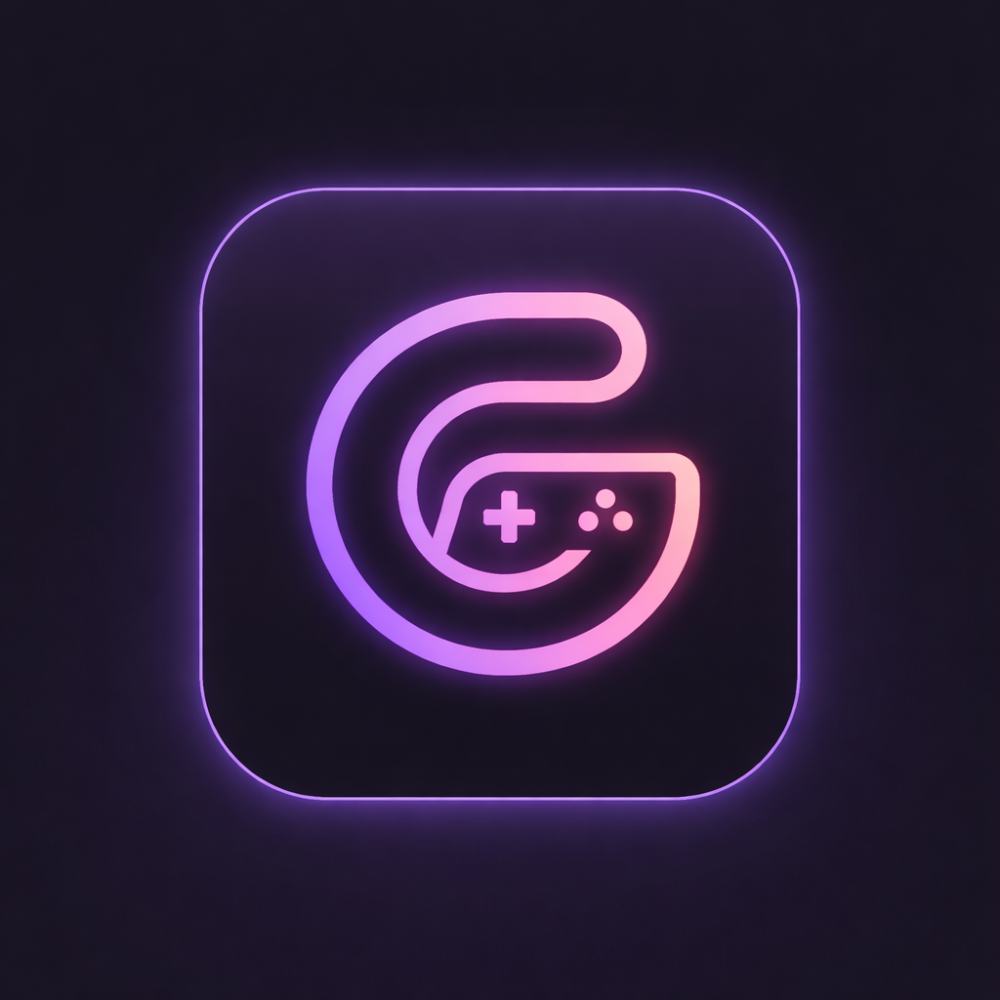
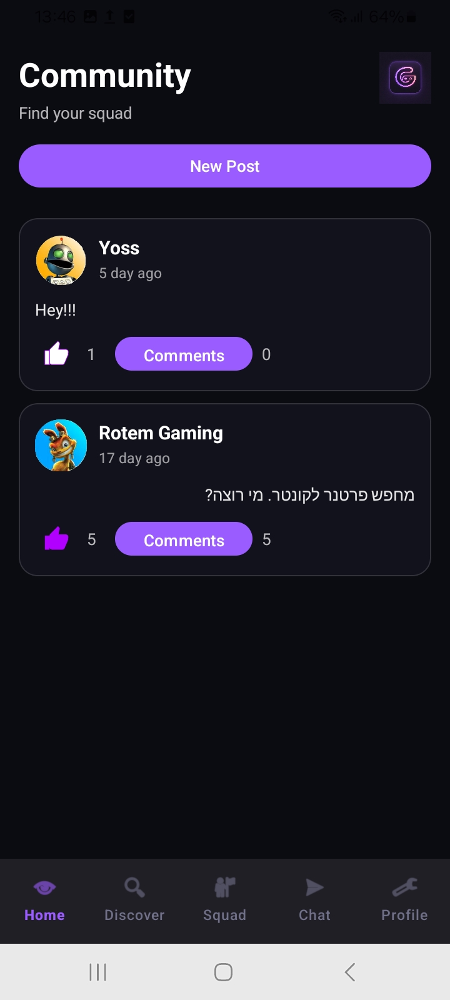
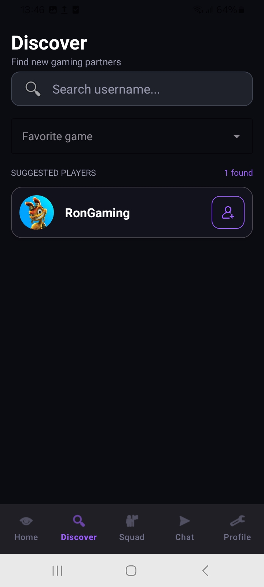
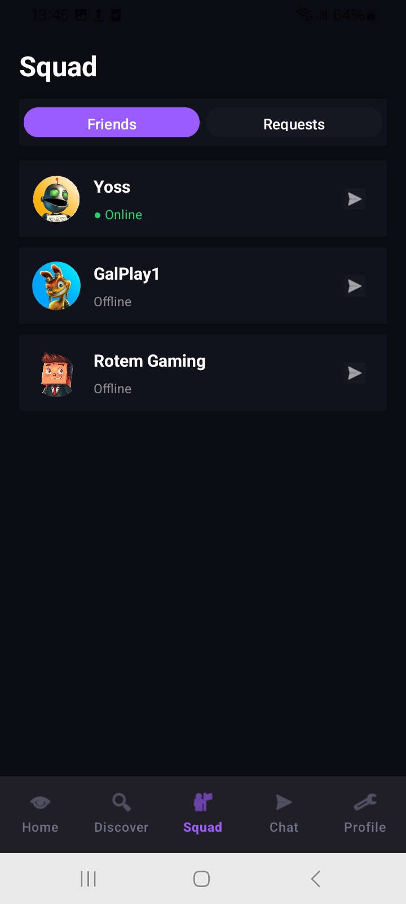
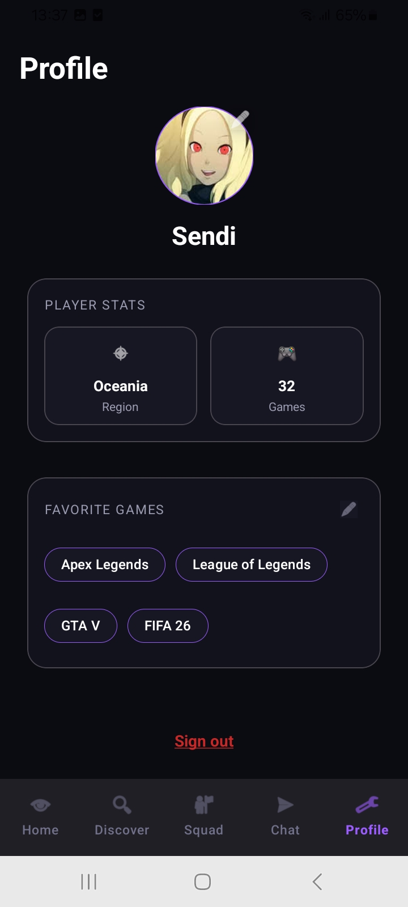
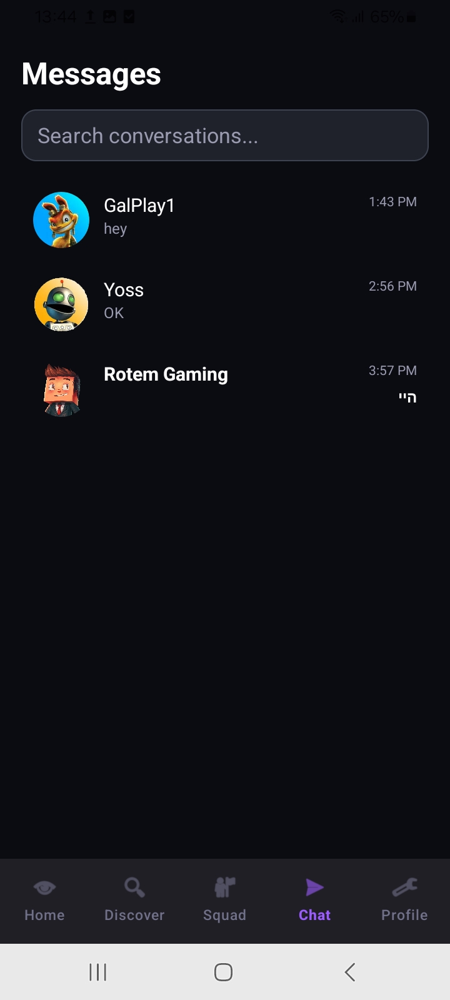
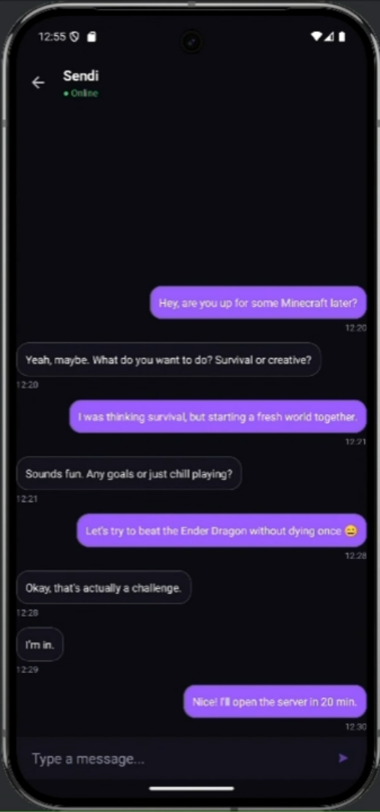
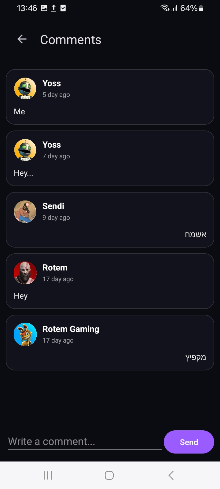
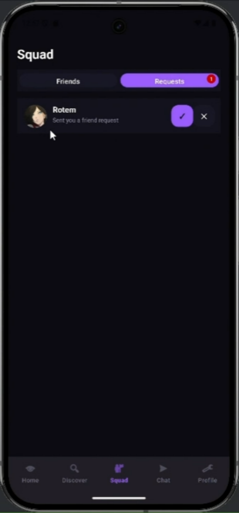

<div align="center">
  
</div>

# 🎮 GameZone – Social Gaming Android App

GameZone is a social Android application designed for gamers who want to connect, discover other players, and interact in a gaming community.

The app allows users to create a gaming profile, find friends, chat in real time, and share posts with the community. It was built using **Kotlin** and **Firebase** technologies to provide a responsive and real-time social experience.

GameZone combines features of a social network with tools designed specifically for gamers.

---

# 🎥 App Demo

[](https://www.youtube.com/watch?v=qHsdwVtQHMQ)

---

# 🚀 Main Features by Screen

## 🏠 Home (Global Social Feed)
The Home screen acts as a public gaming community feed where all users can share posts and interact with others.
* **Dynamic Posts:** Each post includes text content, author username, avatar, like count, comment count, and a timestamp.
* **Real-Time Updates:** Posts, likes, and comments are updated instantly without refreshing the screen, creating a dynamic environment similar to modern social media platforms.
* **Likes & Interactions:** Users can interact with posts through a like system. The system ensures that a user cannot like the same post multiple times, and the counter updates immediately across all devices.
* **Comment System:** Each post has its own comment section featuring real-time updates, comment counters, and immediate visibility for all viewers, allowing conversations to happen directly within the feed.

## 🧭 Discover
The Discover screen is the ultimate tool for expanding your gaming network and finding the right players.
* **Advanced Search:** Easily search for new friends by specific **username** or by **favorite game** to find players with similar interests.
* **Recommended Friends:** The system provides smart friend recommendations to help you discover new gamers and build your squad effortlessly.

## 👥 Squad (Friends System)
The Squad screen manages your social connections and lets you build your own gaming team.
* **Friend Management:** View your friends list, send friend requests, and accept or decline incoming requests.
* **Online Presence System:** Track whether your friends are currently active. Users can appear as *Online*, *Offline*, or *Last seen recently*. The system updates automatically when users open or leave the app.
* **Quick Actions:** Open direct chats right from the friends list and see who is available for a game.

## 💬 Chat (Real-Time Messaging)
One of the core features of GameZone is the private messaging system, enabling instant communication between gaming partners.
* **Instant Messaging:** Real-time messages with automatic conversation creation, automatic scrolling to the newest message, and message timestamps.
* **Visual Organization:** Different visual layouts for sent and received messages. The chat list displays all conversations sorted by the most recent activity, showing the last message preview, participant's avatar, and username.
* **Unread Messages:** The system tracks read receipts. Unread messages are highlighted in the chat list, allowing users to quickly identify new conversations. Messages are automatically marked as read upon opening the chat.

## 👤 Profile
Every user in GameZone creates a personal gaming profile that represents them in the community.
* **Personal Info:** Displays Username, Geographic region (crucial for gaming servers), and the number of games played.
* **Avatar Selection:** Users select their avatar from a predefined set of images inside the app, which is saved in the database and loaded dynamically for fast performance without requiring external storage.
* **Favorite Games System:** Users can select up to five favorite games via an interactive dialog. These appear in the profile as dynamic chips. The system enforces a selection limit to ensure maximums aren't exceeded.

---

# 🛠️ Tech Stack & Architecture

GameZone was built using modern Android development tools and architecture principles.

* **Language:** Kotlin
* **Architecture:** Modular Android architecture with separation between UI and data logic
* **Backend:** Firebase

**Main Technologies:**
* **Firebase Authentication:** User login and identity management.
* **Firebase Firestore:** Real-time database for posts, chats, and user profiles.
* **RecyclerView:** Dynamic lists for chats, posts, and friends.
* **ViewBinding:** Safe UI binding.
* **Material Design Components:** Modern Android UI.

---

# 📱 Key Technical Challenges

During development, several technical challenges were successfully solved:

* **Real-time synchronization:** Ensuring messages, posts, and comments update instantly across multiple users.
* **Chat architecture:** Designing a structure that prevents duplicate conversations between users while keeping messages organized and efficient.
* **Presence tracking:** Managing online and offline states while preventing incorrect status updates when navigating between screens.
* **Dynamic UI generation:** Displaying profile data such as favorite games and avatars dynamically from the database.

---

# ⚙️ Installation & Setup

To run this project locally on your machine, follow these steps:

### Prerequisites
* [Android Studio](https://developer.android.com/studio) installed on your computer.
* An Android emulator or a physical Android device.

### Steps to Run

**1. Clone the repository:**
Open your terminal or command prompt and run:
```bash
git clone https://github.com/RotemGilboa2/GameZone.git

```

**2. Open the project in Android Studio:**

* Launch Android Studio.
* Click on `File` -> `Open` and navigate to the folder where you cloned the repository.

**3. Sync Gradle:**
Wait for Android Studio to index the files and download the necessary Gradle dependencies.

**4. Firebase Configuration ⚠️:**
This app uses Firebase for its backend.
To make it work, you need to add your own `google-services.json` file:

* Go to the [Firebase Console](https://console.firebase.google.com/).
* Create a new project and register an Android app.
* Download the `google-services.json` file.
* Place the file inside the `app/` directory of this project.

**5. Build and Run:**

* Select your emulator or physical device from the top menu.
* Click the **Run** button (▶️) or press `Shift + F10`.

---

# 📷 Screenshots

<table align="center" border="0" cellpadding="0" cellspacing="0">
  <tr>
    <td align="center" valign="bottom"><b>🏠 Home Feed</b></td>
    <td align="center" valign="bottom"><b>🧭 Discover</b></td>
    <td align="center" valign="bottom"><b>👥 Squad</b></td>
    <td align="center" valign="bottom"><b>👤 Profile</b></td>
  </tr>
  <tr>
    <td align="center" style="padding: 10px;">
      
    </td>
    <td align="center" style="padding: 10px;">
      
    </td>
    <td align="center" style="padding: 10px;">
      
    </td>
    <td align="center" style="padding: 10px;">
      
    </td>
  </tr>
  <tr>
    <td align="center" valign="bottom" style="padding-top: 20px;"><b>💬 Chat List</b></td>
    <td align="center" valign="bottom" style="padding-top: 20px;"><b>📱 Inside Chat</b></td>
    <td align="center" valign="bottom" style="padding-top: 20px;"><b>💬 Comments Feed</b></td>
    <td align="center" valign="bottom" style="padding-top: 20px;"><b>📬 Friend Requests</b></td>
  </tr>
  <tr>
    <td align="center" style="padding: 10px;">
      
    </td>
    <td align="center" style="padding: 10px;">
      
    </td>
    <td align="center" style="padding: 10px;">
      
    </td>
    <td align="center" style="padding: 10px;">
      
    </td>
  </tr>
</table>

---

# 👩‍💻 Developer

Created by **Rotem Gilboa**
